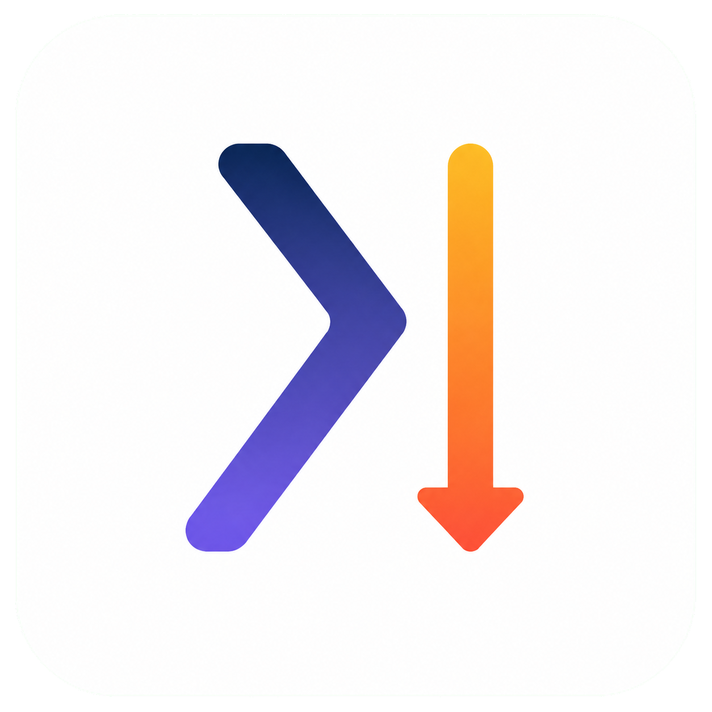

<p align="right">
  <strong>简体中文</strong> · <a href="README_EN.md">English</a>
</p>

<div align="center">
  
  <h1>Axure Downgrade</h1>
  <p><strong>把 Axure RP 11 文件转换为可由 Axure RP 9 打开和继续编辑的工程</strong></p>
  <p>保留页面、文字、图片、基础样式与布局 · 本地处理 · 原文件保持不变</p>
  <p>
    <a href="https://github.com/muxia0396/AxureDowngrade/releases/latest"></a>
    <a href="LICENSE"></a>
    
    
  </p>
</div>

Axure Downgrade 是一款面向 Windows 的 Axure RP 文件降级工具。转换过程以保留静态设计结果为目标，包括页面结构、文字、图片、基础样式、绝对位置、页面层级和常见控件。Axure RP 11 专属能力及交互逻辑可能会在转换过程中被移除，并在转换报告中记录。

> [!IMPORTANT]
> 本项目采用 [PolyForm Noncommercial License 1.0.0](LICENSE)，仅允许非商业用途。由于许可证限制商业使用，因此本项目属于“源码可用”项目，并非 OSI 定义的开源软件。商业使用需要获得许可方的单独书面授权。

## 下载与使用

推荐直接下载 GitHub Release 中的 Windows x64 便携版：

- [下载最新版本](https://github.com/muxia0396/AxureDowngrade/releases/latest)
- [查看全部版本](https://github.com/muxia0396/AxureDowngrade/releases)

使用步骤：

1. 下载 `AxureDowngrade-<版本号>-windows-x64-portable.zip`
2. 可选：使用同版本的 `.sha256.txt` 文件校验压缩包
3. 将 ZIP 完整解压到一个独立目录
4. 保持主程序与 `bin` 目录的相对位置不变
5. 双击运行 `AxureDowngrade.exe`
6. 选择一个 Axure RP 11 `.rp` 文件
7. 首次转换时，选择包含 `AxureRP9.exe` 的 Axure RP 9 安装目录
8. 点击“开始转换”，等待结果和转换报告

### 运行环境

- Windows 10 或 Windows 11，64 位
- Microsoft Edge WebView2 Runtime
- 已合法安装的 Axure RP 9

软件在本地读取和处理文件，不会上传项目内容，也不会覆盖原始 RP 文件。转换结果会保存为新的 RP 9 工程。

## 主要能力

- 识别并分析 Axure RP 11 工程容器
- 将页面、设计文档和文档设置重写为 RP 9 可读取的数据
- 保留文字、图片、基本样式、坐标和尺寸
- 保留页面层级、常见表单控件、连接线和图片资源
- 支持动态面板及其状态包的静态结构转换
- 移除交互记录和无法安全转换的 RP 11 专属字段
- 重建外层 LZ4 索引和对象包
- 使用真实的 Axure RP 9 解析器回读并验证转换结果
- 输出转换状态、错误代码和机器可读的验证信息
- 检测输出文件是否正在被 Axure 占用，避免写入冲突

## 当前状态

当前版本为 **v0.1.7**，已经能够为测试范围内的 Axure RP 11 文档生成可编辑的 RP 9 工程。

现有验证覆盖：

- 受控矩形样例在 RP 9 中实现像素级一致渲染
- 4 个 Axure RP 11 官方训练工程
- 21 个真实页面
- 34 个动态面板状态包
- 5 个 Axure 11 官方控件库
- 1,060 个独立控件测试页面
- 84 个控件库面板状态包
- 文字、图片、矢量形状、动态面板、文本框、复选框、单选框、连接线、页面层级、阴影和多栏布局

在上述样本中，静态记录类型的数量保持不变，被移除的记录仅属于交互类型。重写后的对象包会立即通过 Axure RP 9 解析器重新加载，非交互对象记录、标量属性及内嵌字节数组哈希必须与写入前的快照一致。

本项目仍属于研究性质的兼容转换工具。第三方控件库、自定义控件、缺失字体、外部资源和特殊文档结构可能需要额外的降级规则。

## 转换原则

转换流程遵循以下原则：

1. 原文件只读，不覆盖源文件
2. 优先保留可见的静态设计结果
3. 无法可靠转换的交互能力不进行猜测性迁移
4. 所有删除、替换和降级操作都应在报告中体现
5. 重写后的核心对象必须通过 RP 9 解析器回读验证
6. 输出容器的索引、包数量和校验结果必须保持一致

简化后的处理流程：

```text
RP 11 文件
    ↓
容器探测与包解析
    ↓
版本无关的中间表示
    ↓
静态化与兼容规则处理
    ↓
通过 RP 9 序列化器重写对象包
    ↓
重建 LZ4 容器和索引
    ↓
RP 9 回读验证
    ↓
输出 RP 9 工程与转换报告
```

## 项目结构

```text
AxureDowngrade/
├─ crates/
│  ├─ axure-core/          核心探测、解析、中间表示和降级规则
│  └─ axure-lab/           文件研究、比较和命令行实验工具
├─ desktop/                Tauri 2 + React + TypeScript 桌面程序
│  └─ src-tauri/
│     └─ bin/              RP 9 桥接程序及所需 LZ4 组件
├─ fixtures/               最小化研究样例和中间表示样例
├─ tools/                  桥接构建、打包和验证脚本
├─ docs/                   技术研究、格式证据和错误代码文档
└─ .github/                Issue 模板和自动发布工作流
```

框架选型说明见 [docs/FRAMEWORK_DECISION.md](docs/FRAMEWORK_DECISION.md)。完整技术方案见 [Axure 11 → 9 降级标准化技术文档](docs/Axure11-9降级标准化技术文档.md)。样本支持的格式结论见 [docs/FORMAT_EVIDENCE.md](docs/FORMAT_EVIDENCE.md)。

## 开发环境

需要安装：

- Node.js 20 或更高版本
- Rust stable（MSVC 工具链）
- Visual Studio Build Tools
- “使用 C++ 的桌面开发”工作负载
- Microsoft Edge WebView2 Runtime
- 用于桥接构建和完整验证的合法 Axure RP 9 安装

启动桌面开发环境：

```powershell
cd desktop
npm ci
npm run tauri dev
```

构建前端：

```powershell
cd desktop
npm run build
```

运行 Rust 核心测试：

```powershell
cargo test -p axure-core
```

## 文件研究工具

将一个 RP 文件分析为 JSON：

```powershell
cargo run -p axure-lab -- inspect fixtures\axure9\00-empty.rp
```

比较一组受控的 RP 9 与 RP 11 文件：

```powershell
cargo run -p axure-lab -- compare `
  fixtures\axure9\00-empty.rp `
  fixtures\axure11\00-empty.rp `
  --summary
```

比较报告包含文件哈希、内嵌文件签名、ASCII 与 UTF-16LE 可打印字符串、4 KiB 块熵、共同前后缀长度、对齐相似度和变化字节区间。这些结果仅作为结构研究证据，不能单独证明字段语义。

查看 RP 文件中的独立压缩包：

```powershell
cargo run -p axure-lab -- inspect-packages fixtures\axure11\01-rectangle.rp
```

将版本无关的文档中间表示静态化：

```powershell
cargo run -p axure-lab -- staticize document-ir.json > static-document.json
```

静态化会把嵌套控件转换为页面级绝对坐标，展开分组、组件、中继器和动态面板，并删除非视觉热点。所有丢弃或替换都会进入报告；程序不会静默接受非有限值或负数几何尺寸。

## 构建 RP 9 桥接程序

Windows 桥接程序需要使用本机合法安装的 Axure RP 9 中的序列化和 LZ4 组件：

```powershell
powershell.exe -NoProfile -ExecutionPolicy Bypass `
  -File tools\build-bridge.ps1 `
  -Axure9Directory D:\ToolsWork\Axure9
```

桌面应用会携带构建后的桥接程序和 LZ4 依赖。转换时仍需选择 Axure RP 9 安装目录，以便桥接程序加载 `AxureRP9.exe` 及相关模型程序集。

也可以直接调用桥接程序：

```powershell
desktop\src-tauri\bin\AxureDowngradeBridge.exe `
  D:\ToolsWork\Axure9 `
  input-rp11.rp `
  output-rp9.rp
```

## 验证脚本

验证仓库中的 RP 11 样例：

```powershell
powershell.exe -NoProfile -ExecutionPolicy Bypass `
  -File tools\verify-fixtures.ps1 `
  -Axure9Directory D:\ToolsWork\Axure9
```

输出文件和 `verification-report.json` 会写入 `target\fixture-verification`。

验证官方训练工程：

```powershell
powershell.exe -NoProfile -ExecutionPolicy Bypass `
  -File tools\verify-complex-samples.ps1 `
  -Axure9Directory D:\ToolsWork\Axure9 `
  -Axure11Directory D:\ToolsWork\Axure11
```

报告写入 `target\complex-verification\complex-verification-report.json`。该验证会检查所有记录数量差异是否仅来自交互类型。

验证 Axure 11 官方控件库：

```powershell
powershell.exe -NoProfile -ExecutionPolicy Bypass `
  -File tools\verify-library-samples.ps1 `
  -Axure9Directory D:\ToolsWork\Axure9 `
  -Axure11Directory D:\ToolsWork\Axure11
```

使用真实的 Axure RP 9 GUI 打开并验证输出文件：

```powershell
powershell.exe -NoProfile -ExecutionPolicy Bypass `
  -File tools\verify-axure9-gui.ps1 `
  -Axure9Directory D:\ToolsWork\Axure9
```

## 构建便携版

构建优化后的 Windows 可执行文件：

```powershell
cd desktop
npm run tauri -- build --no-bundle
```

从仓库根目录生成与 GitHub Release 相同结构的便携包：

```powershell
tools\package-release.ps1 -Version 0.1.7 -Force
```

打包脚本会收集：

```text
AxureDowngrade.exe
bin\AxureDowngradeBridge.exe
bin\K4os.Compression.LZ4.dll
bin\K4os.Compression.LZ4.Legacy.dll
README.txt
ERROR_CODES.md
LICENSE
NOTICE
THIRD_PARTY_NOTICES.md
```

最终生成：

```text
artifacts\AxureDowngrade-0.1.7-windows-x64-portable\
artifacts\AxureDowngrade-0.1.7-windows-x64-portable.zip
artifacts\AxureDowngrade-0.1.7-windows-x64-portable.sha256.txt
```

主程序必须与 `bin` 目录保持上述相对结构。

## 错误处理

转换失败时，界面会显示错误代码、原因和详细信息。完整说明见 [docs/ERROR_CODES.md](docs/ERROR_CODES.md)。

桥接程序会返回 JSON 验证报告，其中包含重写的页面、设计文档、设置包数量以及移除的交互记录数量。桌面程序会对这些数据和重建后的 RP 容器进行复核，验证失败时不会把结果报告为成功。

## 发布新版本

发布前需要确保以下文件中的版本号一致：

- `Cargo.toml`
- `desktop/package.json`
- `desktop/src-tauri/tauri.conf.json`

创建并推送版本标签：

```powershell
git tag v0.1.7
git push origin v0.1.7
```

GitHub Actions 会自动执行核心测试、构建 Windows 程序、生成便携版和 SHA-256 文件，并创建或更新对应的 GitHub Release。

## 隐私与安全

- RP 文件只在用户本机处理
- 软件不包含文件上传功能
- 原始 RP 文件不会被覆盖
- 项目不会分发 Axure RP 本体或其专有程序集
- 用户需要自行准备合法授权的 Axure RP 9

安全问题请参阅 [SECURITY.md](SECURITY.md)，并避免在公开 Issue 中上传包含商业信息或个人数据的 RP 文件。

## 参与贡献

欢迎提交错误报告、格式研究证据、兼容性样例和代码改进。提交前请阅读 [CONTRIBUTING.md](CONTRIBUTING.md)。

由于 RP 文件可能包含未公开产品设计、客户信息和个人数据，请只提交自行创建或已经完成脱敏处理的最小复现文件。

## 许可证与声明

Axure Downgrade 的原创代码采用 [PolyForm Noncommercial License 1.0.0](LICENSE)：

- 允许个人、教育、慈善、公共研究及其他非商业用途
- 允许在非商业目的下修改和再分发
- 再分发时必须保留许可证及必要声明
- 商业使用需要获得许可方的单独书面授权

必要版权声明见 [NOTICE](NOTICE)，依赖组件及商标声明见 [THIRD_PARTY_NOTICES.md](THIRD_PARTY_NOTICES.md)。

Axure 是其权利人的商标。本项目为独立研究和兼容转换工具，与 Axure 官方不存在隶属、授权或背书关系。
