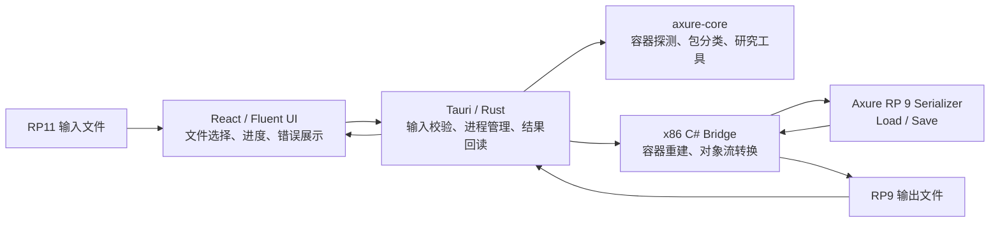
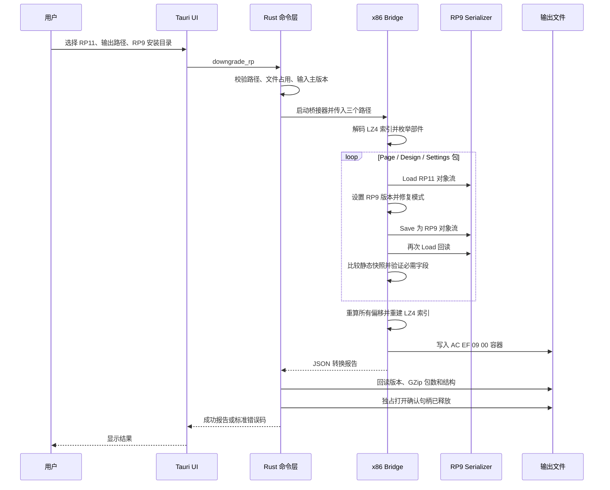

# Axure RP 11 → RP 9 静态降级技术文档

## 1. 文档信息

| 项目 | 内容 |
| --- | --- |
| 项目名称 | Axure Downgrade |
| 文档类型 | 技术设计与实现说明 |
| 对应版本 | 0.1.5 |
| 目标平台 | Windows x64 |
| 目标格式 | Axure RP 9 可编辑 `.rp` 工程 |
| 输入格式 | Axure RP 11 `.rp` 工程 |
| 核心目标 | 保留页面、静态元件、文本、图片、基础样式和绝对位置 |
| 当前状态 | 已通过真实 77 页项目和正式 Axure RP 9 GUI 验证 |
| 更新日期 | 2026-07-28 |

## 2. 项目目标与边界

### 2.1 建设目标

本项目解决 Axure 只支持向上兼容、不支持向下兼容的问题。其目标不是简单修改
文件扩展名或版本号，而是把 RP11 工程中的可见静态内容重新写成 RP9 能够解析、
编辑和保存的对象流。

必须保留的内容：

- 页面及页面层级；
- 元件类型和层级；
- 文本内容；
- 图片与其他内嵌资源；
- 坐标、尺寸和 Z 轴顺序；
- RP9 能识别的填充、边框、字体、阴影等基础样式；
- 母版、动态面板状态等静态结构；
- RP9 打开工程所必需的结构骨架。

允许降级或不承诺保真的内容：

- RP11 专属样式属性；
- RP11 专属工作区状态；
- 交互行为、动画和变量联动；
- RP9 不存在的功能语义。

### 2.2 当前交互策略

用户允许删除交互，但实际研究发现，全面删除 `InteractionTreeMap` 和
`interactionmap` 会破坏页面、母版之间的结构依赖，使 RP9 在加载工程时崩溃。

因此 0.1.5 的策略是：

- 保留 RP9 加载所需的交互结构骨架；
- 不承诺交互在 RP9 中仍按 RP11 的行为执行；
- 静态页面保真优先于交互清理；
- 转换报告当前返回 `interactionsRemoved: 0`。

## 3. 技术选型

### 3.1 桌面框架

项目采用 **Tauri 2 + React + TypeScript**，没有采用 Electron。

主要原因：

- Tauri 复用 Windows WebView2，便携包显著小于捆绑 Chromium 的 Electron；
- Rust 适合进行二进制容器解析、偏移计算、文件占用检查和哈希校验；
- Tauri 命令显式暴露给前端，权限边界清晰；
- 无论使用 Tauri 还是 Electron，都必须通过独立 32 位进程加载 Axure RP 9
  的 .NET Framework 对象序列化器，Electron 无法消除这一桥接层。

### 3.2 32 位 C# 桥接器

Axure RP 9 是 32 位 .NET Framework 应用，其内部对象序列化器不能可靠地直接
加载到 64 位 Tauri 主进程。因此项目使用独立的 x86 C# sidecar：

```text
React/TypeScript UI
        │
        ▼
Tauri/Rust 命令层（64 位）
        │
        ▼
AxureDowngradeBridge.exe（32 位 .NET Framework）
        │
        ▼
本机 AxureRP9.exe 内部序列化器
```

桥接器只调用用户本机已安装的 Axure RP 9，不在发行包中分发
`AxureRP9.exe`。

### 3.3 生产路径与研究路径

项目中存在两条能力路径：

| 路径 | 用途 | 当前角色 |
| --- | --- | --- |
| `axure-core` 中间表示与 `staticize` | 格式研究、通用静态化算法、坐标扁平化 | 研究与扩展基础 |
| C# RP9 序列化桥接器 | 直接读取 RP11 对象包并由 RP9 序列化器重新写出 | 当前生产转换路径 |

生产转换没有把整个工程先转换为自定义 JSON IR，因为直接借助 RP9 自身对象模型
能够最大程度保留未知字段、资源引用和复杂元件结构。

## 4. 总体架构



主要模块：

| 模块 | 路径 | 职责 |
| --- | --- | --- |
| 桌面界面 | `desktop/src` | 输入、输出、RP9 目录选择，进度弹窗，报告与错误展示 |
| Tauri 命令层 | `desktop/src-tauri/src/lib.rs` | 路径校验、启动桥接器、解析进度、回读输出、错误码 |
| RP9 桥接器 | `tools/AxureContainerRewriter/Program.cs` | 容器解析、包重写、模式修复、自检、容器重建 |
| 格式核心 | `crates/axure-core` | 文件探测、包枚举、比较、IR 与静态化研究 |
| 实验 CLI | `crates/axure-lab` | inspect、compare、inspect-packages、staticize |
| 验证脚本 | `tools/verify-*.ps1` | 最小样本、官方项目、官方元件库和 GUI 验证 |
| 格式证据 | `docs/FORMAT_EVIDENCE.md` | 样本驱动的格式研究记录 |
| 错误码 | `docs/ERROR_CODES.md` | 标准化错误码和处理方式 |

## 5. `.rp` 容器格式认识

### 5.1 外层结构

通过 RP9/RP11 同源样本对照，确认 `.rp` 不是标准 ZIP，而是 Axure 自定义容器。

```text
偏移 0      2 字节   魔数 AC EF
偏移 2      2 字节   小端主版本号（09 00 或 0B 00）
偏移 4      4 字节   LZ4 索引长度
偏移 8      N 字节   LZ4 Legacy 压缩的 UTF-8 JSON 索引
索引之后    4 字节   0
数据区                多个部件顺序排列
```

每个数据部件的基本结构为：

```text
uint32 payloadLength
byte[payloadLength] payload
uint32 zeroPadding       // 最后一个部件之后可不存在
```

JSON 索引保存：

- 页面和资源树；
- 每个部件相对于数据区的偏移；
- 页面包和缩略图之间的关系；
- `DesignDocument`、`DocumentSettings` 和版本包位置；
- GUID 和包名称。

### 5.2 部件类型

容器部件分为两类：

1. GZip 包：解压后是 Axure 对象持久化流或配置数据；
2. 非 GZip 部件：缩略图、图片等二进制资源。

这一区分非常重要。真实用户样本包含：

```text
169 个容器部件
 88 个 GZip 包
 81 个非 GZip 二进制部件
```

早期实现错误地把 169 个全部部件与核心识别到的 88 个 GZip 包比较，触发了
`ADG-1303`。0.1.4 起报告同时包含 `parts` 和 `gzipParts`，完整性校验只比较
GZip 包数量。

### 5.3 需要重写的核心对象包

主要对象包包括：

- `Axure:Page`；
- 页面样式和动态面板状态等附属对象包；
- `Axure:DesignDocument`；
- `Axure:DocumentSettings`；
- `BreakingChanges` 版本说明包。

配置包和二进制资源如果不涉及格式变化，则原样复制，避免不必要的数据损失。

## 6. 核心降级流程

### 6.1 端到端时序



### 6.2 第一步：前置校验

Rust 命令层首先执行：

1. 禁止输出路径覆盖原始 RP11 文件；
2. 确认输入文件存在；
3. 确认用户选择的目录直接包含 `AxureRP9.exe`；
4. 若输出已存在，以 Windows 独占方式检查是否可写；
5. 解析容器并确认输入主版本为 11；
6. 定位发行包 `bin/AxureDowngradeBridge.exe`。

任一条件不满足都会返回结构化错误：

```json
{
  "code": "ADG-xxxx",
  "message": "面向用户的原因",
  "details": "路径、系统错误或原始异常"
}
```

### 6.3 第二步：解析外层容器

桥接器执行：

1. 校验 `AC EF` 魔数；
2. 读取主版本和 LZ4 头部长度；
3. 使用 Axure RP 9 自带的 `K4os.Compression.LZ4.Legacy` 解压索引；
4. 将索引反序列化为字典树；
5. 递归收集全部部件的名称、父节点和偏移；
6. 按偏移排序并读取每个 payload；
7. 根据 GZip 签名和对象类型字符串对包分类。

页面计数不依赖模糊字符串匹配，而是在 RP9 对象模型中检查是否存在精确的
`Axure:Page` 记录。只包含 `Axure:PageStyle` 的附属包计入
`objectPackagesRewritten`，不会误报为页面。

### 6.4 第三步：降级版本元数据

转换器会同时处理外层和包内版本：

- 外层主版本改为 `9`；
- 版本部件名称改为 `9.0.0.3754.version`；
- `BreakingChanges` 内容替换为 RP9 版本说明；
- 每个对象包的持久化上下文版本设置为 `9.0.1.0`；
- 被修改对象包最终由 RP9 自带 `Save` 写出。

仅修改文件头的 `0B 00` 为 `09 00` 无法完成这些工作，因此不是有效降级。

### 6.5 第四步：通过 RP9 对象模型重新序列化

桥接器从 `AxureRP9.exe` 中调用内部对象流入口：

```text
Pacj.jac4.Load(...)
Pacj.jac4.Save(...)
```

桥接器把序列化器切换到内存流模式，然后对 Page、DesignDocument、
DocumentSettings 及附属对象包执行：

```text
GZip 解压
→ RP9 Load
→ 设置包版本
→ 模式修复和兼容性清理
→ RP9 Save
→ 再次 RP9 Load
→ 结构与静态快照验证
→ GZip 重压缩
```

使用 RP9 自身写入器是项目能够输出“可编辑 RP9 工程”的关键。它避免了人工重写
整个专有对象流协议，也保留了大量尚未完全命名但 RP9 可以理解的字段。

## 7. 模式转换与兼容性规则

### 7.1 RP9 必需字段修复

RP11 与 RP9 的记录名称可能相同，但字段集合和字段包装器并不完全相同。

当前明确处理：

| 记录 | 必需字段 | 处理方式 |
| --- | --- | --- |
| `Axure:PackageInfo` | `root-panel-infos` | RP11 缺失时创建新的空 RP9 集合 |
| `Axure:MasterPackageInfo` | `root-panel-infos` | 创建新的空 RP9 集合 |
| `Axure:MasterPackageInfo` | `master-mode` | 先保存值，再通过 RP9 `Add` 重建键包装器 |
| `Axure:DesignDocument` | `mastermap` | 先保存值，再通过 RP9 `Add` 重建键包装器 |
| `Axure:PrintSettings` | 方向和四个页边距字段 | 保留并在写出后强制验证 |

`root-panel-infos` 不能直接复用 `dependencies` 的值。真实项目中的
`dependencies` 可能包含嵌套二元组集合，而 RP9 在此处期待的是根面板对象引用
集合。早期复用该对象导致：

```text
InvalidCastException:
集合对象无法转换为根面板对象引用
```

0.1.5 改为实例化一个同类型、但独立且为空的新集合，并增加写出后检查：

- 字段必须存在；
- 值必须是集合；
- 集合元素不能是嵌套集合。

### 7.2 样式降级

明确删除的 RP11 专属样式名：

```text
Radius
Duration
Easing
ScaleX
ScaleY
TranslateX
TranslateY
Rotate
```

明确识别的 RP11 专属样式 ID：

```text
108
109
1400–1405
```

数值型 DOA 键不是全局唯一模式。相同数值在 `PropList` 中可能表示样式，在
`PrintSettings` 或 `DesignDocument` 中却可能表示必需结构字段。

因此当前规则是：

- `PropList` 内按样式 ID 清理；
- 普通字典中，只在 `Axure:DiagramObject:*` 可视元件记录上按数值 ID 清理；
- 非可视记录只按明确的 RP11 专属属性名清理；
- 禁止对全对象图执行无上下文的数值键删除。

该规则解决了打印方向和页边距被误删后产生的 `NullReferenceException`。

### 7.3 文档设置清理

RP11 专属、RP9 不认识的工作区字段会被删除：

```text
FloatingEditorLayoutInfos
PrototypeDeleted
ShowLastPublishedCurrentLinks
UploadedSitmapIds
```

打开标签页列表中无效的空 GUID 也会同步移除，避免 RP9 尝试恢复不存在的编辑器
标签。页面、元件和资源数据不受这类工作区清理影响。

### 7.4 静态内容保留策略

桥接器优先保留原对象记录，而不是把所有元件栅格化为图片：

- 元件仍是 RP9 中可选择、可编辑的对象；
- 文本仍是文本；
- 图片资源仍以内嵌资源存在；
- 坐标、尺寸和基本样式由原记录保留；
- 原始页面树、母版关系和面板状态尽量保留；
- 不识别的非目标包原样复制。

## 8. 容器重建

修改包的压缩长度变化后，原索引中的所有后续偏移都会失效。桥接器必须完整重建
数据区：

1. 按原始顺序排列所有部件；
2. 从偏移 0 开始重新计算每个部件位置；
3. 把新偏移写回对应 JSON 索引节点；
4. 重新序列化 UTF-8 JSON；
5. 使用 LZ4 Legacy 重压缩索引；
6. 写入 `AC EF 09 00` 文件头；
7. 依次写入长度、payload 和分隔 0；
8. 先在内存中完整组装输出，再一次性写入文件并释放所有流。

二进制缩略图和媒体资源即使不是 GZip，也必须参与偏移重算，但不参与 GZip
完整性计数。

## 9. 多层验证体系

项目不是以“文件成功写出”作为成功标准，而是采用多层验证。

### 9.1 包内回读

每个被重写的对象包会立即再次由 RP9 `Load` 读取。

写出前后分别生成静态快照，比较：

- 非交互记录类型；
- 记录数量；
- 标量属性；
- GUID、字符串、数值和布尔值；
- 二进制数组的长度和 SHA-256；
- 可枚举结构的规范化表示。

快照不一致时直接终止转换。

### 9.2 RP9 必需结构验证

回读后额外验证：

- PackageInfo 和 MasterPackageInfo 存在合法 `root-panel-infos`；
- `root-panel-infos` 中不存在错误的嵌套集合；
- MasterPackageInfo 存在 `master-mode`；
- DesignDocument 存在 `mastermap`；
- PrintSettings 存在 `landscape` 和四个页边距字段。

### 9.3 Rust 外层回读

桥接器结束后，Rust 再次独立解析输出：

- 外层主版本必须为 9；
- 实际 GZip 包数必须等于桥接器报告的 `gzipParts`；
- 至少有一个 DesignDocument 和一个 DocumentSettings 被重写；
- 必须报告 RP9 必需字段修复；
- 静态记录和标量验证数必须大于 0。

### 9.4 文件句柄验证

转换完成后，Rust 最多执行 20 次独占打开检查，每次间隔 100 ms。

只有输出文件能够被独占读写时才报告 100% 完成。超过约 2 秒仍被占用时返回
`ADG-1304`。

### 9.5 真实 GUI 验证

最终验收必须包含正式 `AxureRP9.exe`，不能只依赖自研解析器。

0.1.5 发行前验证的真实用户项目结果：

```text
容器部件：                 169
GZip 包：                   88
页面：                      77
附属对象/母版包：            4
DesignDocument：             1
DocumentSettings：           1
验证静态记录：            8999
验证静态标量：          528516
删除不兼容样式属性：       6504
补充/重建 RP9 必需字段：     90
输出字节：             18314661
```

便携包内桥接器生成的文件已由正式 Axure RP 9 成功打开，主窗口标题为：

```text
v015-portable-output-rp9 - Axure RP 9 Enterprise Edition
```

没有再出现“报告错误”弹窗。

### 9.6 回归样本

当前自动化验证覆盖：

| 样本组 | 覆盖 |
| --- | --- |
| 最小样本 | 空白工程、矩形元件 |
| 官方训练项目 | 4 个工程、21 个页面、34 个附属对象包 |
| 官方元件库 | 5 个库、1,060 个页面、84 个附属对象包 |
| 用户真实项目 | 77 个页面、4 个附属对象/母版包 |

官方元件库覆盖矢量图、图片、文本框、复选框、单选框、连接线、动态面板、表格、
表格单元格、中继器、菜单、树、列表框、组合框、文本域、内联框架、截图和图层。

## 10. 两个关键故障的最终定位

### 10.1 `ADG-1303` 完整性校验失败

表面现象：

```text
桥接器报告 169 个部件，核心只识别到 88 个包
```

根因：

- 桥接器的 169 是所有容器部件；
- Rust 核心的 88 是 GZip 包；
- 两个不同口径被直接比较。

修复：

- 桥接报告新增 `gzipParts`；
- `parts` 仅用于总部件统计；
- 完整性检查改为 `gzipParts == outputReport.packages.len()`。

### 10.2 Axure 提示“文件正由另一进程使用”

该提示不是根因，而是 Axure 的二次异常。

实际调用过程：

1. Axure 已经打开并持有文件流；
2. 对象模型加载发生 `InvalidCastException` 或 `NullReferenceException`；
3. Axure 进入 `Axure.Legacy.Version3_1.FileIO.IsLegacyFile` 回退路径；
4. 回退路径再次以不共享方式打开同一个文件；
5. Axure 与自身持有的文件流冲突；
6. 最终展示误导性的“另一进程使用”。

通过在诊断副本中记录被回退逻辑掩盖的原始异常，最终发现两处问题：

1. `root-panel-infos` 错误复用了非空 `dependencies` 集合；
2. 无上下文的数值样式键清理误删了 `PrintSettings` 必需字段。

修复后，正式 Axure RP 9 已成功打开由发行包生成的最终文件。

## 11. 进度与错误处理

### 11.1 进度协议

桥接器通过标准错误流输出：

```text
PROGRESS<TAB>百分比<TAB>阶段代码
```

Rust 将阶段代码映射为中文状态并通过 Tauri 事件
`downgrade-progress` 推送给前端。

主要阶段：

```text
路径检查
RP11 结构解析
RP9 序列化器初始化
容器读取
版本元数据降级
页面与资源包扫描
页面与静态元件转换
设计文档转换
文档设置转换
索引重建
RP9 文件写入
回读验证
文件释放确认
```

前端弹窗用一行流式结构显示：

```text
xx%    当前降级：正在转换……
```

### 11.2 错误码分层

| 范围 | 含义 |
| --- | --- |
| `ADG-10xx` | 输入、输出和安装目录 |
| `ADG-11xx` | RP 容器解析和输入版本 |
| `ADG-12xx` | C# 桥接器启动与报告 |
| `ADG-13xx` | 输出回读、完整性和文件释放 |
| `ADG-20xx` | 分析功能 |
| `ADG-21xx` | 桌面权限 |
| `ADG-9000` | 尚未分类的异常 |

完整错误码见 [ERROR_CODES.md](ERROR_CODES.md)。

## 12. 构建、测试与发布

### 12.1 环境要求

- Windows；
- Node.js 20 或更高；
- Rust stable + MSVC 工具链；
- Microsoft Edge WebView2；
- Visual Studio Build Tools；
- 本机合法安装的 Axure RP 9；
- 当前验证目标为 Axure RP 9 `9.0.0.3754`。

### 12.2 构建桥接器

```powershell
powershell.exe -NoProfile -ExecutionPolicy Bypass `
  -File tools\build-bridge.ps1 `
  -Axure9Directory D:\ToolsWork\Axure9
```

### 12.3 运行测试

```powershell
cargo test --workspace
cargo clippy --workspace --all-targets -- -D warnings

cd desktop
npm run build
```

最小样本：

```powershell
powershell.exe -NoProfile -ExecutionPolicy Bypass `
  -File tools\verify-fixtures.ps1 `
  -Axure9Directory D:\ToolsWork\Axure9
```

官方训练项目：

```powershell
powershell.exe -NoProfile -ExecutionPolicy Bypass `
  -File tools\verify-complex-samples.ps1 `
  -Axure9Directory D:\ToolsWork\Axure9 `
  -Axure11Directory D:\ToolsWork\Axure11
```

官方元件库：

```powershell
powershell.exe -NoProfile -ExecutionPolicy Bypass `
  -File tools\verify-library-samples.ps1 `
  -Axure9Directory D:\ToolsWork\Axure9 `
  -Axure11Directory D:\ToolsWork\Axure11
```

### 12.4 便携版构建

```powershell
cd desktop
npm run tauri -- build --no-bundle
```

便携目录必须保持：

```text
axure-downgrade-desktop.exe
ERROR_CODES.md
bin/
  AxureDowngradeBridge.exe
  K4os.Compression.LZ4.dll
  K4os.Compression.LZ4.Legacy.dll
```

0.1.5 发行包：

```text
artifacts/AxureDowngrade-0.1.5-windows-x64-portable.zip
```

SHA-256：

```text
B7F56D0583FCACA26DD5C2E41D19F9C42C3EE72754F93B88C909616BAF17D9DD
```

## 13. 安全与数据保护

- 禁止覆盖输入源文件；
- 转换前检查输出文件是否被占用；
- 本地处理，不上传 RP 文件；
- 桥接器只在用户指定的 RP9 安装目录中加载依赖；
- 不修改 Axure 安装文件；
- 不在发行包中包含 Axure 商业软件；
- 输出完成后检查文件句柄释放；
- 建议用户始终保留原始 RP11 文件和独立备份。

## 14. 已知限制与后续扩展

### 14.1 已知限制

- 仅面向 Windows；
- 依赖已验证版本的 Axure RP 9 内部对象模型；
- 交互行为不作为保真承诺；
- 第三方元件库和自定义对象仍需增加样本；
- 字体缺失会由目标机器的字体回退策略处理；
- 外部链接资源不可用时可能出现资源缺失；
- RP11 新增的未知字段必须遵循“先识别、再映射、禁止静默删除”原则。

### 14.2 新兼容规则的标准流程

新增兼容性规则时必须：

1. 准备最小 RP9/RP11 同源样本；
2. 使用 `axure-lab compare` 和 `inspect-packages` 定位差异；
3. 通过 RP9 对象模型确认记录类型和字段语义；
4. 避免仅依据混淆字段名或数值 ID 推断全局含义；
5. 实现记录类型限定的转换规则；
6. 增加写出后结构断言；
7. 运行最小样本、官方项目、元件库和真实项目回归；
8. 最终必须由正式 Axure RP 9 GUI 打开验证。

## 15. 核心工程经验

项目最终跑通依赖以下原则：

1. **不是改版本号，而是用 RP9 自身重新序列化对象。**
2. **容器层、包层、对象层必须分别处理和验证。**
3. **保留未知数据优先于大范围清理。**
4. **任何数值字段都必须放在具体记录类型中解释。**
5. **静态快照验证只能证明序列化稳定，不能替代 RP9 业务模型验证。**
6. **错误弹窗可能是二次异常，必须捕获被回退逻辑掩盖的原始异常。**
7. **自研解析器通过不等于目标软件能打开，真实 Axure GUI 是最终裁判。**
8. **每次真实故障都要转化为结构断言，防止同类问题回归。**

这套流程把一次性的格式逆向工作，转化为可重复、可报告、可回归的工程化降级
管线，也是项目最终能够稳定生成 RP9 可编辑工程的核心原因。
